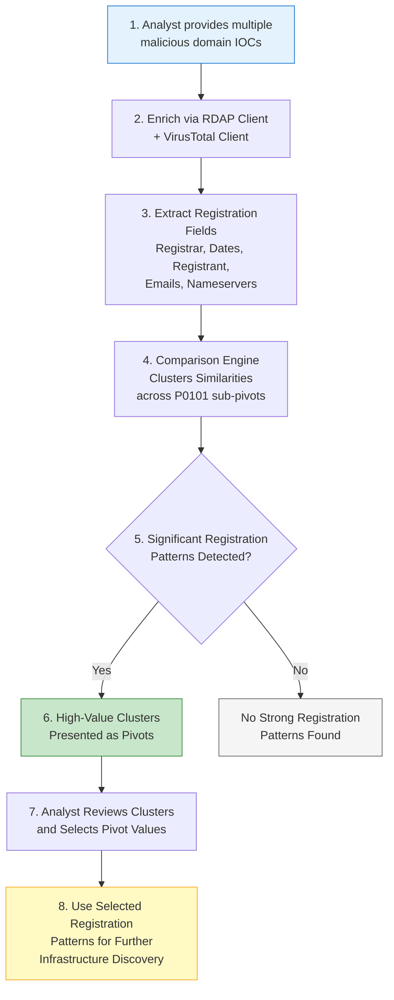

# P0101 - Registration

**As a** cyber threat intelligence analyst  
**I want** to compare registration details between two or more malicious domains  
**So that** I can identify any patterns that exist and use them to discover additional adversary infrastructure based on registration similarities.

## Acceptance Criteria
- System enriches domains with registration data using the RDAP client (primary source for registrar, creation date, registrant, registrant email, and nameservers) and the VirusTotal client (supplementary whois/registration fields)
- When an analyst runs a comparison across multiple IOCs, the system automatically analyzes registration fields for statistically significant similarities
- Similarities are surfaced using the established P0101 sub-pivot clustering logic (Registrar, Registration date, Registrant, Registrant email, Name Server, Name Server Domain)
- Registration-based clusters and similarities are clearly presented to the analyst as actionable infrastructure pivots
- Analyst can easily use any identified registration pattern value for further hunting or pivoting

## Why This Pivot Matters
Domain registration data remains one of the most reliable sources for linking infrastructure even when other observables are heavily obfuscated. By comparing registration attributes (who registered the domains, when, through which registrar, and with what nameservers), analysts can uncover operational patterns used by the same threat actor or affiliate programs. The combination of RDAP (direct authoritative data) and VirusTotal (historical and supplemental context) provides robust coverage for this type of analysis.

## Workflow

