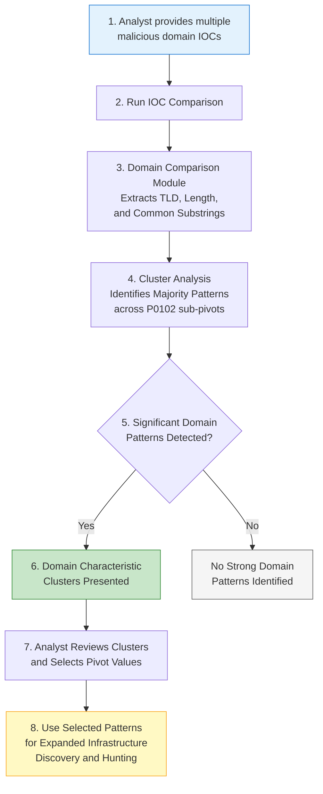

# P0102 - Domain

**As a** cyber threat intelligence analyst  
**I want** to compare domain name characteristics (TLD, substrings, length, and structure) across multiple malicious domains  
**So that** I can identify naming patterns and conventions that help me discover additional adversary infrastructure.

## Acceptance Criteria
- System performs domain characteristic analysis as part of multi-IOC comparisons using the dedicated domain comparison module
- Automatically detects and surfaces statistically significant similarities for:
  - P0102.001 - Domain: TLD (shared top-level domains)
  - P0102.002 - Domain: Substring (common substrings or naming patterns)
  - P0102.004 - Domain: Length (similar domain name lengths)
  - P0102.003 - Domain: Subdomain (when applicable)
- Clusters are presented clearly with counts, percentages, and matching IOCs
- Analyst can use any identified domain characteristic (e.g., a shared substring or unusual TLD) as a pivot for further hunting
- Optional substring filter (`sstring`) is supported during comparison to focus analysis on specific patterns

## Why This Pivot Matters
Threat actors frequently reuse naming conventions, prefixes, suffixes, or TLD choices across campaigns. These patterns can be strong signals even when registration data is privacy-protected or heavily laundered. Substring and structural analysis is particularly effective for detecting typosquatting, campaign-specific branding, and affiliate program infrastructure. The IOC Comparer's domain module makes these patterns immediately visible during routine comparison workflows.

## Workflow

