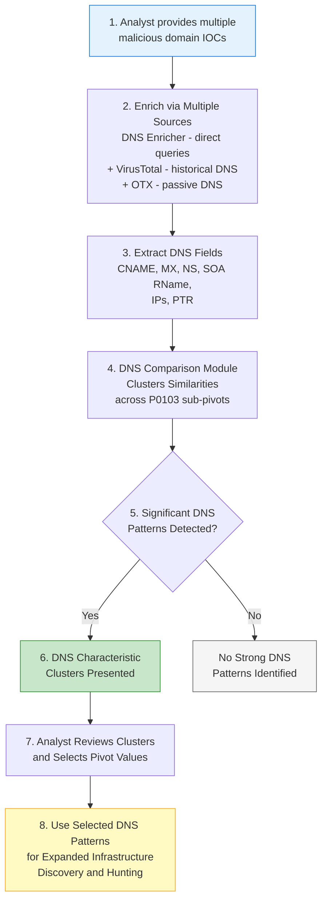

# P0103 - DNS

**As a** cyber threat intelligence analyst  
**I want** to compare DNS characteristics across multiple malicious domains  
**So that** I can identify shared DNS infrastructure patterns that help me discover additional adversary infrastructure.

## Acceptance Criteria
- System enriches domains with DNS data from multiple independent sources: the dedicated DNS Enricher (direct queries via dnspython + Cloudflare DoH), VirusTotal (historical DNS records from last_dns_records), and OTX (passive DNS data including MX and CNAME), with additional nameserver context from RDAP
- When comparing multiple IOCs, the system runs the DNS comparison module to detect statistically significant similarities across DNS fields
- Automatically surfaces clusters for the following sub-pivots:
  - P0103.001 - DNS: CNAME
  - P0103.002 - DNS: MX Record
  - P0103.003 - DNS: IP Address
  - P0103.004 - DNS: SOA RName
  - P0103.005 - DNS: PTR
  - P0103.006 - DNS: Name Server
  - P0103.007 - DNS: Name Server Domain
- DNS-based similarities and clusters are clearly presented with counts, percentages, and matching IOCs
- Analyst can use any identified DNS pattern (e.g., a shared MX provider, common nameserver, or specific CNAME target) as a pivot for further hunting

## Why This Pivot Matters
DNS configuration is often one of the most stable and revealing aspects of adversary infrastructure. Shared CNAME targets, MX providers, nameserver choices, or even specific IP resolutions frequently indicate that domains are operated by the same actor or affiliate program, even when registration data is privacy-protected. The combination of direct DNS queries (DNS Enricher), historical records (VirusTotal), and passive DNS (OTX), plus nameserver data from RDAP, provides rich, multi-source signals that are difficult for operators to fully obfuscate at scale.

## Workflow

