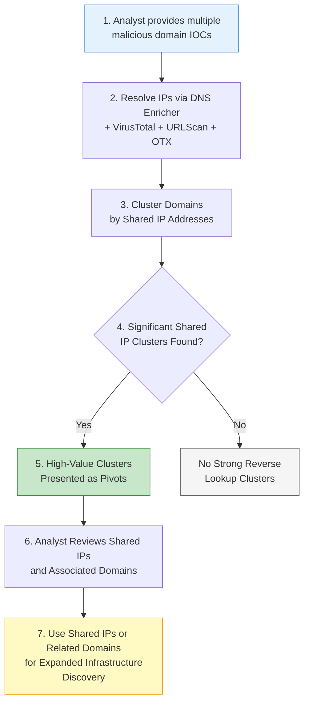

# P0201 - Reverse Lookup

**As a** cyber threat intelligence analyst  
**I want** to identify other domains that share the same IP address as my malicious IOCs  
**So that** I can discover additional adversary infrastructure hosted on the same servers or infrastructure.

## Acceptance Criteria
- System resolves domains to IP addresses using the DNS Enricher and supplements with IP data from VirusTotal, URLScan, and OTX passive DNS
- When comparing multiple IOCs, the system identifies statistically significant overlaps in resolved IP addresses
- Shared IP addresses are surfaced as high-value clusters (often overlapping with P0103.003 - DNS: IP Address logic)
- Analyst can easily pivot from a shared IP to hunt for additional domains in threat intelligence platforms
- Results distinguish between dedicated IPs and heavily shared hosting providers where appropriate

## Why This Pivot Matters
Reverse IP lookups remain one of the most direct ways to uncover related infrastructure. When multiple malicious domains resolve to the same IP (especially non-shared or cloud-hosted IPs), it is a strong indicator of common ownership or operational control. This technique is particularly effective against actors who reuse the same bulletproof hosting or VPS providers across campaigns.

## Workflow

