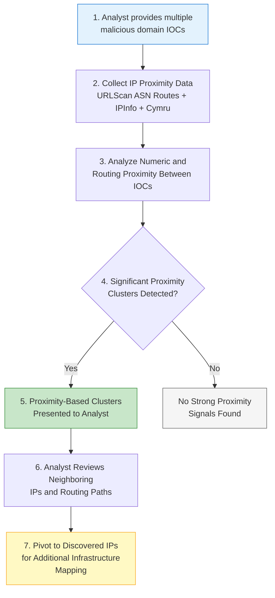

# P0202 - Proximity

**As a** cyber threat intelligence analyst  
**I want** to examine IP addresses and routing paths in close proximity to my malicious IOCs  
**So that** I can discover additional adversary-controlled infrastructure on neighboring IPs or within the same hosting footprint.

## Acceptance Criteria
- System collects IP proximity and ASN routing data, primarily from URLScan (domain_asn_routes) and supplemented by IPInfo and Cymru enrichers
- When comparing multiple IOCs, the system surfaces statistically relevant overlaps in IP proximity or ASN-level routing paths
- Proximity-based clusters are presented clearly with context (e.g., same /24 subnet, same ASN route)
- Analyst can use identified neighboring IPs or routes as pivots for further hunting
- The system provides appropriate caveats when proximity signals appear in large shared hosting ranges

## Why This Pivot Matters
Sophisticated actors sometimes spread infrastructure across neighboring IPs within the same provider or ASN to maintain resilience while staying operationally close. Proximity pivots can reveal "sibling" infrastructure that would otherwise be missed by exact IP or domain matching. This technique has proven effective in campaigns such as Gootloader and various SEO poisoning operations.

## Workflow

