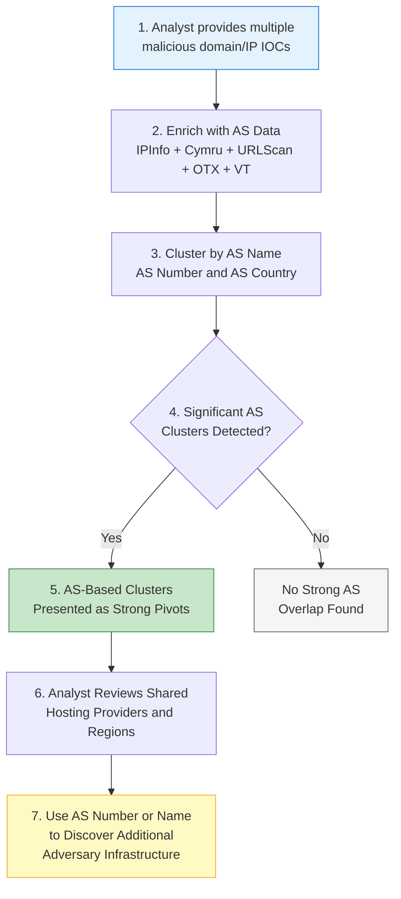

# P0203 - AS

**As a** cyber threat intelligence analyst  
**I want** to compare Autonomous System attributes (name, number, and country) across my malicious IOCs  
**So that** I can identify patterns in hosting providers and infrastructure footprints used by the adversary.

## Acceptance Criteria
- System enriches IPs and domains with AS data from multiple sources including IPInfo Enricher, Cymru Enricher, URLScan, OTX, and VirusTotal
- When performing multi-IOC comparisons, the system clusters on AS Name (P0203.001), AS Number (P0203.002), and AS Country (P0203.003)
- Statistically significant AS overlaps are surfaced with clear counts, percentages, and matching IOCs
- The system handles both exact AS number matches and normalized AS name clustering effectively
- Analyst can use a shared AS (by number or name) as a high-value pivot for broader infrastructure discovery

## Why This Pivot Matters
Many threat actors and affiliate programs consistently use the same hosting providers or bulletproof ASNs across multiple campaigns. Clustering by AS provides a powerful, relatively stable signal for expanding infrastructure maps, especially when combined with other pivots such as registration data or domain characteristics. AS-level pivots have been instrumental in tracking groups such as SmartApeSG, LandUpdate808, and TA582.

## Workflow

