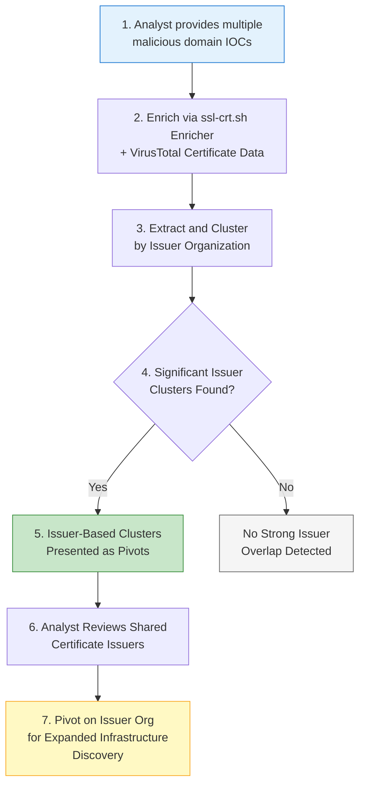

# P0301 - Issuer Organization

**As a** cyber threat intelligence analyst  
**I want** to compare the issuing organizations of SSL certificates used by my malicious IOCs  
**So that** I can identify patterns in certificate usage that reveal additional adversary infrastructure.

## Acceptance Criteria
- System retrieves certificate data primarily from the ssl-crt.sh Enricher and supplements with certificate information from VirusTotal
- When comparing multiple IOCs, the system clusters on the Issuer Organization field (P0301)
- Statistically significant overlaps in certificate issuers are surfaced as clusters with counts and matching IOCs
- The system handles common issuers (e.g., Let's Encrypt, Sectigo, DigiCert) appropriately while still surfacing meaningful clusters
- Analyst can use a shared issuer organization as a pivot for further hunting in certificate transparency logs or domain intelligence platforms

## Why This Pivot Matters
Threat actors frequently reuse the same certificate authorities or even the same automated issuance processes across campaigns. Clustering by issuer organization (especially when combined with other pivots) can surface related domains that were issued certificates around the same time or from the same account/automation pipeline. This technique has been particularly useful against groups like SmartApeSG that rely heavily on free certificate services.

## Workflow

