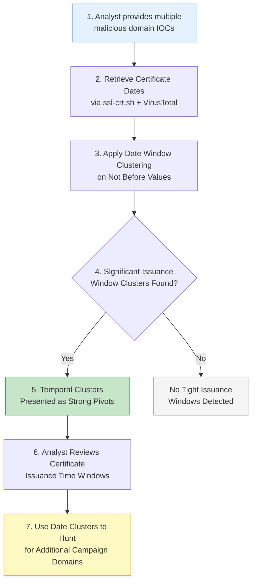

# P0303 - Not Before Date

**As a** cyber threat intelligence analyst  
**I want** to compare the "Not Before" issuance dates of SSL certificates across my malicious IOCs  
**So that** I can detect coordinated campaigns where multiple domains were issued certificates within a short time window.

## Acceptance Criteria
- System collects certificate "Not Before" dates from the ssl-crt.sh Enricher and VirusTotal
- When comparing multiple IOCs, the system applies date window clustering (typically within a 7-day window) on certificate issuance dates
- Significant clusters of certificates issued in close temporal proximity are surfaced with date ranges and matching IOCs
- The system distinguishes between high-volume automated issuers and more targeted issuance patterns
- Analyst can use a tight issuance window as a strong temporal pivot for discovering additional campaign infrastructure

## Why This Pivot Matters
Adversaries often spin up large numbers of domains in short bursts for campaigns. When many of these domains receive SSL certificates within a narrow time window, it creates a powerful temporal signal. Clustering on "Not Before" dates has proven effective for linking infrastructure that would otherwise appear unrelated, especially when combined with other pivots such as domain characteristics or hosting data.

## Workflow

