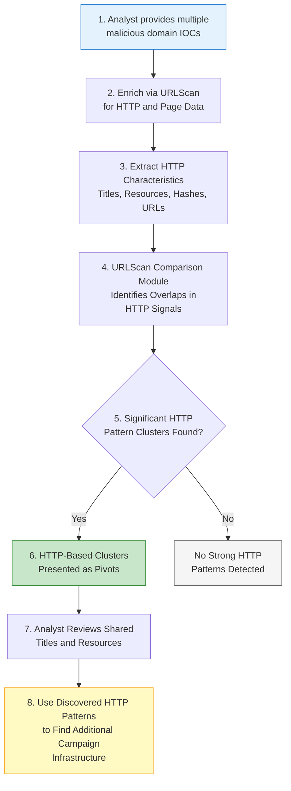

# P0401 - HTTP

**As a** cyber threat intelligence analyst  
**I want** to compare HTTP-level signals across multiple malicious domains  
**So that** I can identify shared web infrastructure, page patterns, and resource reuse that reveal additional adversary-controlled sites.

## Acceptance Criteria
- System primarily enriches domains with HTTP and web page data via the URLScan Enricher
- When performing multi-IOC comparisons, the system runs the URLScan comparison module to detect similarities in:
  - P0401.001 - HTTP: Title
  - P0401.003 - HTTP: Shared Resources
  - P0401.004 - HTTP: Same Resources
  - P0401.006 - HTTP: Same Resource Name
  - (and other HTTP characteristics as they are implemented)
- Statistically significant overlaps in page titles, external resources, resource hashes, or URL patterns are surfaced as clusters
- The system presents clear HTTP-based pivots with supporting context from the scans
- Analyst can use discovered shared titles, resources, or filenames as new pivots for further hunting

## Why This Pivot Matters
HTTP-level observables (especially page titles, embedded third-party resources, and reused filenames or assets) often expose the tooling, kits, or operational patterns used by threat actors. These signals can link domains even when they use different registrars, nameservers, or hosting providers. URLScan provides rich, publicly available data on live web behavior that is difficult for operators to fully sanitize at scale, making HTTP pivots particularly valuable for expanding infrastructure maps during active campaigns.

## Workflow

